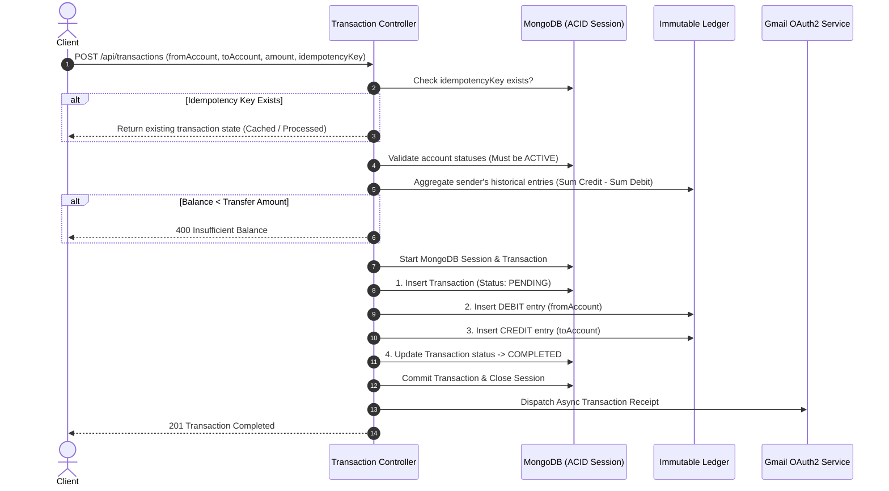

# 🏦 Banking Transaction System & Event-Sourced Ledger

[](https://nodejs.org/)
[](https://expressjs.com/)
[](https://mongoosejs.com/)
[](https://event-sourced-ledger-cng1.onrender.com)
[](https://event-sourced-ledger-cng1.onrender.com/api-docs/)
[](https://opensource.org/licenses/ISC)

> 🚀 **Live Deployment on Render**:
> - **Base URL:** [https://event-sourced-ledger-cng1.onrender.com](https://event-sourced-ledger-cng1.onrender.com)
> - **Interactive Swagger UI:** [https://event-sourced-ledger-cng1.onrender.com/api-docs/](https://event-sourced-ledger-cng1.onrender.com/api-docs/)

A production-grade, highly reliable banking transaction backend built on **Event Sourcing**, **Double-Entry Bookkeeping**, and **Strict ACID Transactions**. 

Unlike naive banking applications that store a mutable `balance` field susceptible to race conditions and audit loss, this system stores **immutable financial events**. Account balances are dynamically derived from an append-only ledger, ensuring cryptographic auditability, idempotency against network retries, and strict consistency.

---

## 📑 Table of Contents

- [Core Architectural Principles](#-core-architectural-principles)
- [Transaction Lifecycle Flow](#-transaction-lifecycle-flow)
- [Key Features](#-key-features)
- [Tech Stack](#-tech-stack)
- [Data Models & Schema Design](#-data-models--schema-design)
- [API Reference](#-api-reference)
  - [How to Test via Live Swagger Docs](#-how-to-access--test-via-live-swagger-documentation)
- [Environment Variables](#-environment-variables)
- [Getting Started](#-getting-started)
- [API Walkthrough & Examples](#-api-walkthrough--examples)
- [Security & Invariants](#-security--invariants)
- [Roadmap & Enhancements](#-roadmap--enhancements)

---

## 🏛️ Core Architectural Principles

### 1. Append-Only Immutable Ledger (Event Sourcing)
In traditional databases, `account.balance = account.balance - amount` introduces destructive updates: past states are overwritten, leaving no proof of intermediate states. 
In this system:
- The **`Ledger` collection is strictly append-only**.
- All write operations (`updateOne`, `findOneAndUpdate`, `deleteOne`, `deleteMany`, etc.) are intercepted and aborted by schema middleware.
- Account balances are calculated dynamically via MongoDB aggregation:
  $$\text{Balance} = \sum(\text{CREDIT}) - \sum(\text{DEBIT})$$

### 2. Double-Entry Bookkeeping
Money cannot appear or disappear. Every valid transaction creates two balanced ledger entries:
- A `DEBIT` entry against the sender's account.
- A `CREDIT` entry against the recipient's account.
The sum of all ledger movements in a transfer always equals zero.

### 3. Distributed Idempotency
Network requests can fail, time out, or be retried by clients. Every transaction endpoint requires a unique client-generated `idempotencyKey` (UUIDv4):
- Duplicate requests are caught before ledger creation.
- If already `COMPLETED`, the stored transaction result is returned immediately without re-executing transfers.
- Prevents double-spend and duplicate payments.

### 4. ACID Multi-Document Transactions
All ledger entries and status transitions are wrapped inside a **MongoDB Session Transaction** (`session.startTransaction()`). If any failure occurs during debit or credit creation, the entire operation rolls back atomically.

---

## 🔄 Transaction Lifecycle Flow



---

## ✨ Key Features

- **Double-Entry Ledger:** Guaranteed debit/credit parity for every transfer.
- **Dynamic Balance Calculation:** On-the-fly balance evaluation via MongoDB aggregation pipeline.
- **Idempotent APIs:** Guaranteed safety across retry storms and duplicate requests.
- **Strict Ledger Immutability:** Mongoose middleware blocks document modifications and deletions.
- **JWT Authentication & Token Revocation:** Cookie and Header authentication backed by MongoDB TTL token blacklisting.
- **System User Governance:** Special privileges for system accounts to inject seed funds (`/system/initial-funds`).
- **OAuth2 Gmail Integration:** Real-time email notifications for registration and payment confirmations via Google APIs.
- **Interactive OpenAPI Documentation:** Fully documented with Swagger UI at `/api-docs`.

---

## 🛠️ Tech Stack

| Component | Technology | Description |
| :--- | :--- | :--- |
| **Runtime** | Node.js (CommonJS) | Server runtime |
| **Framework** | Express 5.x | Web framework with native async support |
| **Database** | MongoDB & Mongoose 9.x | Document store with replica set transaction support |
| **Auth** | JSON Web Tokens & bcryptjs | Stateless auth with salted hashing & blacklist TTL |
| **Mail Service** | Googleapis (Gmail API v1) | OAuth2 mail dispatch |
| **Documentation** | Swagger-JSDoc & Swagger-UI | OpenAPI 3.0 specification |

---

## 🗄️ Data Models & Schema Design

### 1. `User` (`src/models/user.model.js`)
- `name`: Full name of account holder.
- `email`: Unique email with regex validation.
- `password`: Hashed using `bcryptjs` with salt factor 10 (hidden by default).
- `systemUser`: Immutable boolean flag indicating internal banking authority.

### 2. `Account` (`src/models/account.model.js`)
- `user`: Reference (`ObjectId`) to owner.
- `status`: Enum (`ACTIVE`, `FROZEN`, `CLOSED`). Default: `ACTIVE`.
- `currency`: Default `INR`.
- **Method:** `getBalance()` runs an aggregation query over the `Ledger` to sum credits and debits.

### 3. `Transaction` (`src/models/transaction.model.js`)
- `fromAccount`: Sender account ID.
- `toAccount`: Beneficiary account ID.
- `amount`: Transfer quantity (`min: 0`).
- `status`: Enum (`PENDING`, `COMPLETED`, `FAILED`, `REVERSED`).
- `idempotencyKey`: Unique indexed client string to prevent duplicate charges.

### 4. `Ledger` (`src/models/ledger.model.js`)
- `account`: Account reference.
- `amount`: Movement magnitude.
- `transaction`: Transaction reference.
- `type`: Enum (`CREDIT`, `DEBIT`).
- **Immutability Enforcement:** `pre` hooks reject all update and delete queries.

### 5. `TokenBlacklist` (`src/models/blacklist.model.js`)
- Stores invalidated JWTs upon logout with MongoDB TTL indexing (`expireAfterSeconds: 259200` = 3 days).

---

## 🚀 API Reference

Interactive API documentation and schema playgrounds are available at:  
- **Live Production (Render):** 👉 [https://event-sourced-ledger-cng1.onrender.com/api-docs/](https://event-sourced-ledger-cng1.onrender.com/api-docs/)
- **Local Development:** 👉 `http://localhost:3000/api-docs`

### Authentication (`/api/auth`)
| Method | Endpoint | Access | Description |
| :--- | :--- | :--- | :--- |
| `POST` | `/api/auth/register` | Public | Register new account holder and return JWT |
| `POST` | `/api/auth/login` | Public | Authenticate user credentials and return JWT |
| `POST` | `/api/auth/logout` | Authenticated | Invalidate token and add to blacklist |

### Accounts (`/api/accounts`)
| Method | Endpoint | Access | Description |
| :--- | :--- | :--- | :--- |
| `POST` | `/api/accounts` | Authenticated | Create a new bank account for current user |
| `GET` | `/api/accounts` | Authenticated | Retrieve all bank accounts belonging to current user |
| `GET` | `/api/accounts/balance/:accountId` | Authenticated | Compute real-time balance for specific account |

### Transactions (`/api/transactions`)
| Method | Endpoint | Access | Description |
| :--- | :--- | :--- | :--- |
| `POST` | `/api/transactions` | Authenticated | Execute an idempotent fund transfer between accounts |
| `POST` | `/api/transactions/system/initial-funds` | System User | Inject initial/seed funds from the system account |

---

### 📖 How to Access & Test via Live Swagger Documentation

You can test every endpoint directly in your browser using the live Swagger interface without needing Postman:

1. **Open the Live Docs:** Go to [https://event-sourced-ledger-cng1.onrender.com/api-docs/](https://event-sourced-ledger-cng1.onrender.com/api-docs/).
2. **Create / Authenticate a User:**
   - Expand `POST /api/auth/register` (or `POST /api/auth/login`).
   - Click **Try it out**, enter your name, email, and password, and click **Execute**.
   - Copy the `token` string returned in the JSON response.
3. **Authorize the Swagger Session:**
   - Scroll to the top right of the Swagger UI and click the green **Authorize 🔓** button.
   - In the `bearerAuth (http, Bearer)` dialog, paste your JWT token into the **Value** box.
   - Click **Authorize** and then **Close**.
4. **Test Protected Endpoints:**
   - You can now execute protected operations like creating an account (`POST /api/accounts`), checking balance (`GET /api/accounts/balance/{accountId}`), and transferring funds (`POST /api/transactions`) with full idempotency support right in the browser!

---

## ⚙️ Environment Variables

Create a `.env` file in the project root with the following parameters:

```env
PORT=3000
MONGO_URI=mongodb+srv://<username>:<password>@cluster0.mongodb.net/banking_transaction_system?retryWrites=true&w=majority
JWT_SECRET=your_super_secret_jwt_key

# Google OAuth2 Credentials for Gmail API
CLIENT_ID=your_google_oauth_client_id.apps.googleusercontent.com
CLIENT_SECRET=your_google_oauth_client_secret
REFRESH_TOKEN=your_oauth_refresh_token
EMAIL_USER=your_email@gmail.com

# Deployment URL (for Swagger Documentation Server)
BASE_URL=http://localhost:3000
```

> [!NOTE]
> MongoDB multi-document transactions require either a **MongoDB Replica Set** (local or via Docker) or **MongoDB Atlas**. Standalone MongoDB instances without replica sets will reject transactions.

---

## 🏁 Getting Started

### 1. Prerequisites
- **Node.js** v18 or higher
- **MongoDB** v6.0+ (Replica Set enabled) or MongoDB Atlas cluster

### 2. Installation
```bash
git clone https://github.com/JayantSinghRawat/Banking_Transaction_System.git
cd Banking_Transaction_System
npm install
```

### 3. Setup Environment
```bash
cp .env.example .env # Or create .env manually
```

### 4. Running the Application
```bash
# Development Mode (auto-restart with Nodemon)
npm run dev

# Production Mode
npm start
```
The server will boot up on `http://localhost:3000`.  
Open `http://localhost:3000/api-docs` to test endpoints in your browser.

---

## 💡 API Walkthrough & Examples

> 💡 **Tip:** Replace `http://localhost:3000` with `https://event-sourced-ledger-cng1.onrender.com` to run these requests directly against the live deployment.

### 1. Register a User
```bash
curl -X POST http://localhost:3000/api/auth/register \
  -H "Content-Type: application/json" \
  -d '{
    "name": "Jane Doe",
    "email": "jane@example.com",
    "password": "securePassword123"
  }'
```

### 2. Create a Bank Account
```bash
curl -X POST http://localhost:3000/api/accounts \
  -H "Authorization: Bearer <YOUR_JWT_TOKEN>"
```
*Response:*
```json
{
  "account": {
    "_id": "67a531cf4a0f4439c3e981aa",
    "user": "67a531b24a0f4439c3e981a8",
    "status": "ACTIVE",
    "currency": "INR",
    "createdAt": "2026-10-08T12:00:00.000Z"
  }
}
```

### 3. Check Account Balance
```bash
curl -X GET http://localhost:3000/api/accounts/balance/67a531cf4a0f4439c3e981aa \
  -H "Authorization: Bearer <YOUR_JWT_TOKEN>"
```
*Response:*
```json
{
  "accountId": "67a531cf4a0f4439c3e981aa",
  "balance": 15000
}
```

### 4. Transfer Funds (Idempotent)
```bash
curl -X POST http://localhost:3000/api/transactions \
  -H "Authorization: Bearer <YOUR_JWT_TOKEN>" \
  -H "Content-Type: application/json" \
  -d '{
    "fromAccount": "67a531cf4a0f4439c3e981aa",
    "toAccount": "67a5323e4a0f4439c3e981b2",
    "amount": 2500,
    "idempotencyKey": "a85cfc87-84d7-4638-b6d4-83ef4a50d418"
  }'
```

---

## 🔒 Security & Invariants

1. **Strict Immutability:** No financial records in the `Ledger` can ever be updated or purged via Mongoose queries.
2. **Double-Spend Prevention:** ACID transactions combined with unique idempotency keys guarantee money cannot be created or duplicated during network retries.
3. **Password Security:** Salted bcrypt hashing with hidden password projection on user queries.
4. **Token Invalidation:** Stateless tokens are actively revoked upon logout and purged automatically via TTL indices.

---

## 🗺️ Roadmap & Enhancements

Key opportunities for future development:
- [ ] **Atomic Balance Locking:** Run balance verification within the active MongoDB transaction session to eliminate race conditions under concurrent requests.
- [ ] **Account Ownership Authorization:** Ensure `fromAccount` in transfers strictly belongs to `req.user`.
- [ ] **Integer/Cents Currency Model:** Transition amounts to integer cents/paise or `Decimal128` to avoid IEEE 754 floating-point rounding anomalies.
- [ ] **Ledger Snapshots / Checkpointing:** Cache periodic account balance snapshots to maintain sub-millisecond query latency as ledger entries scale.
- [ ] **Message Queue for Notifications:** Offload Gmail dispatch to an asynchronous background worker (e.g., BullMQ / Redis) to decouple email delivery latency from transaction response time.
- [ ] **Transaction History & Statement Endpoints:** Provide paginated statements with ledger audit logs for clients.
- [ ] **Automated Test Suite:** Integration tests covering race conditions, double-spend attempts, and idempotency guarantees using Jest and Supertest.

---

## 📄 License

This project is licensed under the [ISC License](LICENSE).
